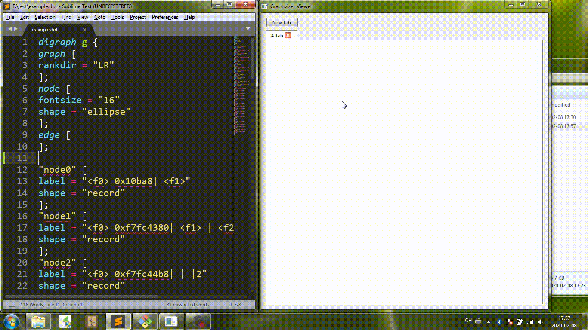

# Graphvizer

`Graphvizer` is a `Graphviz` plugin for Sublime Text 3. It can make your experience more pleasant when editing a `dot` language file. You just need to edit your file at the speed of thought and this plugin will render the image and refresh it in real time. If the syntax is invalid, the plugin will show you some error messages.

# Features

* Real-time rendering
* Real-time syntax checking
* Error message prompting

# Usage

**Note: Please ensure the file syntax is set to `Graphviz (DOT)`. You can do this by `View -> Syntax` menu or clicking the bottom right corner of Sublime Text window.**

### Open image window

`ctrl+shift+g` or `Tools -> Graphvizer -> Open Rendered Image`


### Open `Graphvizer` panel

`ctrl+shift+x` or `Tools -> Graphvizer -> Show Graphvizer Panel`


### Powerful image viewer

If you think viewing image in Sublime Text is very inconvenient because it doesn't support zoom or pan. You can try [Graphvizer Viewer](https://github.com/hao-lee/GraphvizerViewer) which is created as a supplement for Graphvizer.



# Why do I create this plugin?

`Graphviz` is an awesome visualization tool, but it's very inconvenient to write a dot file by hand. I have to use `dot file.dot -Tpng -o file.png` to render image manually again and again and I don't know whether the syntax is correct or not instantly. `Atom` editor has an excellent plugin called `GraphViz preview+`, but I can't find any plugins like this on `packagecontrol.io`. Finally, I create `Graphvizer`.

# Installation

## 1. Prerequisites

I can't implement the `Graphviz` visualization algorithm from scratch, so this plugin needs `dot` command to render the image. In other words, you need to install the official `Graphviz` on your system.

### For Linux/Mac

Use your operating system package manager (e.g. `dnf` or `apt-get`) to install `Graphviz`.

On my `Fedora 27 X86_64`, the command is:

```
sudo dnf install graphviz
```
> Use `dot -V` to make sure you have configured all things correctly and you should see the version info of `Graphviz`.

### For Windows

Download from here: https://graphviz.gitlab.io/download/. The installation is very simple but you need additional configuration to tell the plugin where to find the `dot` command.

**Method 1:** Add the path of `dot.exe` (e.g. `D:\Graphviz\bin`) to the `PATH` environment variable of your system. Then the `dot` command can be accessed from the command prompt(a.k.a. `cmd`) and this plugin can also invoke it. If you don't know how to do this, [this article](https://www.howtogeek.com/118594/how-to-edit-your-system-path-for-easy-command-line-access/) may help you.

> Type `dot -V` in Windows `cmd` window and hit enter. If everything is OK, you will see the version info of `Graphviz`.

**Method 2:** Specify the path of `dot` explicitly with plugin settings file. See the full details in [Configurations](#configurations) part.

## 2. Installing `Graphvizer`

### Using Package Control *(Recommended)*

The easiest way to install `Graphvizer` is through Package Control.

Bring up the Command Palette (`Control+Shift+P` on Linux/Windows, `Command+Shift+P` on Mac). Select `Package Control: Install Package` and then search `Graphvizer` to install it.

### Manually

`git clone` this project to your system or just download the zip file from GitHub and decompress it. Now you have got the `Graphvizer` directory.

Using the Sublime Text 3 menu `Preferences -> Browse Packages...` to find out your package directory path. On my `Windows 7`, the path is `D:\Sublime Text 3\Data\Packages`. Move the entire `Graphvizer` directory into the package directory. Press `Ctrl+Shift+P` in Sublime and run `Satisfy Dependencies`. Restart Sublime. Done!

---

# Configurations

The default configurations are as follows. If you want to change some configurations, open `Preference -> Package Settings -> Graphvizer -> Settings - User` and copy the following content to the opened file. Save it after modifying it according to your needs. The meaning of each configuration is explained subsequently.

```
{
	// "dot_cmd_path" is the path of dot command. Here are some examples.
	// For Windows: "D:\\Graphviz\\bin\\dot.exe"
	// For Linux: "/usr/bin/dot"
	// For OSX: "/usr/bin/dot"
	// If you have added this path to the PATH environment variable, you can
	// use "dot" instead of the full absolute path.
	"dot_cmd_path": "dot",
	// If the dot command takes more than `dot_timeout` seconds, it will be
	// terminated. The default value is 3 seconds.
	"dot_timeout": 3,
	// "show_image_with" controls how to show the image.
	// The default value is "layout", so the image will be shown in a separated
	// layout by default. If you want to show it in a new window instead,
	// change the following value to "window". If you just want to show the image
	// in a new tab, change the value to "tab".
	"show_image_with": "layout",
	// "image_dir" controls where the image is saved.
	// The default value is "same" which means the image will be saved in the same
	// directory as the dot file.
	// If the value is "tmp", system temporary directory is used.
	// You can also set it to an arbitrary directory according to your needs.
	// Example for Windows: "E:\\homework\\image\\"
	// Example for Linux/OSX: "/home/haolee/image/"
	"image_dir": "same",
	// The default behavior is rendering the image in real time.
	// If set to false, the image will only be rendered when the file is saved.
	"render_in_realtime": true,
	// Default layout engine. Valid values including dot, neato, fdp, sfdp, twopi and circo.
	"default_layout_engine": "dot",
	// Default output format. Valid values including png, jpg, svg, pdf, gif, bmp, ps, ps2 and psd.
	// NOTE: the dot command also supports many other formats as detailed in the below link.
	// https://graphviz.gitlab.io/_pages/doc/info/output.html
	// You can certainly use any of them as the value of default_output_format, but these formats
	// won't be shown in Tools->Graphvizer->Output Format menu.
	"default_output_format": "png"
}
```

### Set `dot` path

If you want to specify the path of you `dot` command, please set `"dot_cmd_path"` according to your system. This configuration is useful on Windows.

### Set timeout for `dot` command

If you are editing a very large graph, the `dot` command may need a long time to complete and your CPU may be exhausted. For this reason, I set a timeout for `dot` command and it will be terminated if it takes too long to complete. You can change the timeout by setting `"dot_timeout"` as needed. Generally, you don't need to change this configuration.

### Show the image in a new window

By default, the plugin will show the image in a separated layout.

You can also use a new window to show the image. This is flexible in some cases, especially when you have two monitors. Just change the value of `"show_image_with"` from `"layout"` to `"window"` and save it.

If your monitor is small, you may want to show the image in a new tab to save space. To do this, change the value to `"tab"`.

(You may need to restart Sublime Text 3 to take effect.)

### Set the image directory

By default, the value of `"image_dir"` is `"same"` which means the generated image will be saved in the same directory as the dot file. If the value is `"tmp"`, the image will be saved in system temporary directory. If you want to change the location to other directory, you can set `"image_dir"` to any path according to your needs.

Example for Windows: `"E:\\homework\\image\\"`
Example for Linux/OSX: `"/home/haolee/image/"`

## Render the image when the file is saved

By default, the image is rendered in real time. If you only want the image to be rendered when the file is saved, you can set `"render_in_realtime"` to `false`.

## Set the default layout engine

By default, this plugin uses `dot` engine to render images just as you pass `-Kdot` argument to `dot` command. If you want to use other engines including `neato`, `fdp`, `sfdp`, `twopi` and `circo`, just set `"default_layout_engine"` to engine name.

# Key Bindings

The default key bindings are as follows. If you want to change the default key bindings. Open `Preference -> Package Settings -> Graphvizer -> Key Bindings - User` and copy the following content to the opened file. Save it after changing `ctrl+shift+g` or `ctrl+shift+x` to other shortcuts according to your needs. (The below example is for Windows.)

```
[
	{
		"keys": ["ctrl+shift+g"],
		"command": "open_image",
		"context":
		[
			{"key": "selector", "operator": "equal", "operand": "source.dot"}
		]
	},
	{
		"keys": ["ctrl+shift+x"],
		"command": "show_panel",
		"args": {"panel": "output.graphvizer_panel"},
		"context":
		[
			{"key": "selector", "operator": "equal", "operand": "source.dot"}
		]
	}
]
```

---

# Known Issues

* The rendering process won't be triggered during Sublime Text startup. This means if you double click a dot file to launch Sublime Text, the corresponding image won't be generated. This behavior is because Sublime Text doesn't invoke `on_load()` function on its first launch. There is [an issue](https://github.com/sublimehq/sublime_text/issues/5) about this problem. [Other people](https://forum.sublimetext.com/t/on-load-eventlistener-not-called-on-first-launch/29105) also encountered it. The workaround is so weird that I don't want to fix this. You may need to make some changes in your dot code to trigger the rendering.

* After changing the layout engine or the output format, you still need to make some changes in your dot code to trigger the rendering. This issue can be fixed but it need more effort.

---

# To-Do List

- [x] Configure the `dot` command path in `Settings`.
- [x] Key Bindings for Window/Linux/OSX separately.
- [x] Add `Preference -> Package Settings` menu items to custom user settings.
- [x] Being able to show the image in a separated layout.
- [x] Set timeout for `dot` command.
- [x] Being able to set the image directory.
- [x] Render the image when the file is saved.
- [x] Support specifying image output format
- [x] Supporting specifying layout engine
- [x] Introduce Graphvizer Viewer
- [x] Save the image in the same directory as the dot file by default
- [x] Set cwd for dot command to support shapefile attribute
* For other features, please open an issue.

# LICENSE

GNU GENERAL PUBLIC LICENSE Version 2 (GPLv2)
