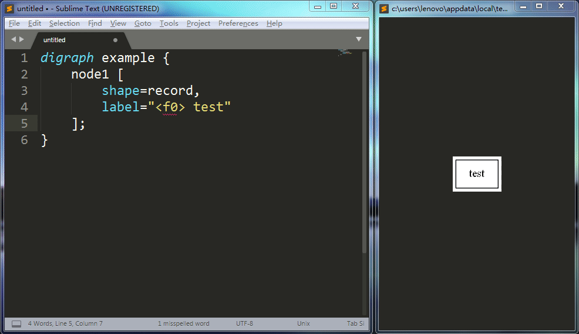
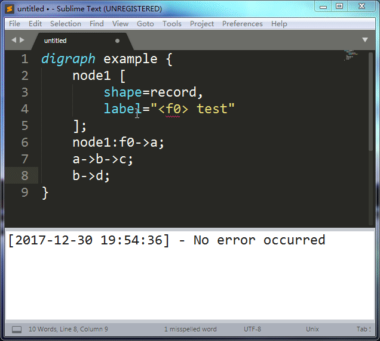

# Graphvizer

`Graphvizer` is a `Graphviz` plugin for Sublime Text 3. It can make your experience more pleasant when editing a `dot` language file. You just need to edit your file at the speed of thought and this plugin will render the image and refresh it in real time. If the syntax is invalid, the plugin will show you some error messages.

# Features

* Real-time rendering
* Real-time syntax checking
* Error message prompting

# Usage

**Note: Please ensure the file syntax is set to `Graphviz (DOT)`. You can do this by `View -> Syntax` or clicking the bottom right corner of Sublime Text window.**

### Open image window

`ctrl+shift+g` or `Tools -> Graphvizer -> Open Rendered Image`



### Open `Graphvizer` panel

`ctrl+shift+x` or `Tools -> Graphvizer -> Show Graphvizer Panel`



### About Key Bindings

If you want to change the default key bindings, use `Preference -> Package Settings -> Graphvizer -> Key Bindings - User` to do that.

# Why do I create this plugin?

`Graphviz` is an awesome visualization tool, but it's very inconvenient to write a dot file. I have to use `dot file.dot -Tpng -o file.png` to render image manually again and again and I can't know whether my syntax is correct or not instantly. `Atom` has a good plugin called `GraphViz preview+` which is excellent, but I don't find any plugin like it on `packagecontrol.io`. Finally, I create `Graphvizer`.

# Installation

## 1. Prerequisites

I can't implement the `Graphviz` visualization algorithm from scratch, so this plugin needs `dot` command to render the image. In other words, you need to install the official `Graphviz` on your system.

### For Linux/Mac

Use your operating system package manager (e.g. `dnf` or `apt-get`) to install `Graphviz`.

On my `Fedora 27 X86_64`, the command is:

```
sudo dnf install graphviz
```
> Use `dot -V` to make sure you have configured all things correctly and you should see the version info of `Graphviz`.

### For Windows

Download from here: https://graphviz.gitlab.io/download/. The installation is very simple but you need additional configuration. Otherwise, the plugin don't know where to invoke the `dot` command.

**Method 1:** Add the path of `dot.exe` (e.g. `D:\Graphviz\bin`) to the `PATH` environment variable of your system. Then the `dot` command can be accessed from the command prompt(a.k.a. `cmd`) and this plugin can also invoke it. If you don't know what the `PATH` is, Google may help you. I won't explain the full details. Sorry about that.

> Type `dot -V` in Windows `cmd` window and hit enter. If everything is OK, you will see the version info of `Graphviz`.

**Method 2:** Specify the path of `dot` explicitly with settings file. Open `Preference -> Package Settings -> Graphvizer -> Settings - User`. Copy the following content to the opened file and set `dot_cmd_path` according to your system.

```
{
	// "dot_cmd_path" is the path of dot command. Here are some examples.
	// For Windows: "D:\\Graphviz\\bin\\dot.exe"
	// For Linux: "/usr/bin/dot"
	// For Linux: "/usr/bin/dot"
	// If you have added this path to the PATH environment variable, you can
	// use "dot" instead of the full absolute path.
	"dot_cmd_path": "dot"
}
```

## 2. Installing `Graphvizer`

### Using Package Control

The easiest way to install `Graphvizer` is through Package Control. You must have known how to do this.

Bring up the Command Palette (`Control+Shift+P` on Linux/Windows, `Command+Shift+P` on Mac). Select `Package Control: Install Package` and then search `Graphvizer` to install it.

### Manually

`git clone` this project to your system or just download the zip file from GitHub and decompress it. Now you have got the `Graphvizer` directory.

Using the Sublime Text 3 menu `Preferences -> Browse Packages...` to find out your package directory path. On my `Windows 7`, the path is `D:\Sublime Text 3\Data\Packages`. Move the entire `Graphvizer` directory into the package directory. Done!

# To-Do List

- [x] Configure the `dot` command path in `Settings`.
- [x] Key Bindings for Window/Linux/OSX separately.
- [x] Add `Preference -> Package Settings` menu items to custom user settings.
- [ ] Display image in another layout instead of a new window.
* For other features, please open an issue.

# LICENSE

GNU GENERAL PUBLIC LICENSE Version 2 (GPLv2)